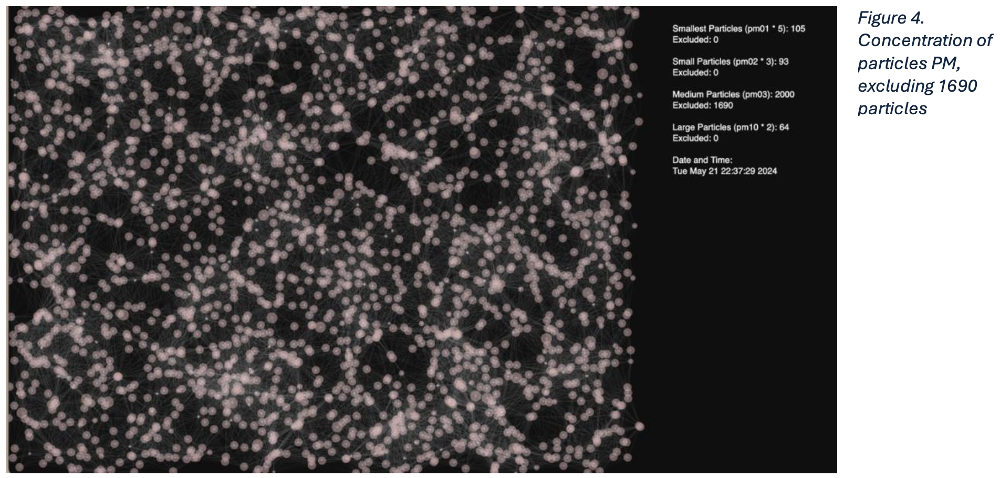

# Visualizing Change: Harnessing Art, Data, and Advocacy for Cleaner Air and Healthier Communities

**“The fog in London assumes all sorts of colors; there are black, brown, yellow, green, purple fogs, and the interest in painting is to get the objects as seen through these fogs.” - Claude Monet, artist**

**“No one ever made a decision because of a number. They need a story.” – Daniel Kahneman, psychologist, behavioral economist, and author**

## Project Overview

In an era marked by environmental crises and techno-solutionism, the presence of data-driven approaches to positive environmental impact is to be expected. While data has proven to be a powerful tool and the role of data visualization and advocacy in driving policy change cannot be overstated, assuming that data alone will lead to quick policy change oversimplifies the complexity of environmental challenges. This visualization project explores how the University of the Arts London (UAL) can harness data visualization and advocacy to address air quality issues effectively.

When interacting with CCI’s air quality data, several variables must be examined. Not only do the sensors capture a variety of particles, but the placement of sensors, both geographically and either inside or outside buildings, affects the numbers we are seeing. For this particular analysis, we focus on the presence of particles of different sizes both inside and outside of CCI’s classrooms across Greencoat, Peckham Road, and High Holborn. This visualization project attempts to analyze the data through visualization and later views that analysis through a lens of policy formulation. Throughout this process, the close links between emotion and information literacy were considered, specifically how emotion forms a part of critical thinking and therefore must be included in information literacy to generate learning, and engagement and be a catalyst for change.

To accomplish this, the data is visualized in two main ways. The first is a large line graph where the concentration of three different-sized particles can be seen to evolve through a month's time for historic morning and nighttime readings. This first visualization conveys information in a more traditional and scientific approach. The second seeks to generate public engagement and generate an emotional or sensorial link to the air quality around the city. **Using p5**, the second visualization draws out a system of particles, resembling a constellation moving around through space, the sizes of the particles are visually represented. This second visualization captures the morning and nighttime variables at a specific moment in time by creating two versions, a darker version for the nighttime data and a lighter version corresponding to the luminosity data. The color selection corresponds to the typical luminosity of respective pm and am data.

## Conclusions
A series of insights can be drawn from the visualizations. From the line graph depicted below, we can see three types of particles being shown. Each line represents the amount of different-sized particles per cubic meter. Immediately, it is easy to recognize that there seems to be a larger concentration of larger particles (PM10) and a lower concentration of smaller particles (PM01). Apart from this, when hovering over the graph, we can see whether the reading being shown is a nighttime or a daytime reading which also lets us determine that readings at night usually have a much higher concentration of particles of all three sizes. Now, since CCI’s sensors are placed both indoors and outdoors, we will not be looking at that variable specifically. We will assume that the readings are higher at PM than AM and that there is a higher concentration of larger particles in general.

## Line Graph


### Morning and Nighttime Visualization


### Nighttime Visualization Scraping 1960 harmful particles



## Installation Instructions

### Libraries Used for the Line Graph

Ensure the following libraries are installed:
```python
import pandas as pd
import matplotlib.pyplot as plt
# Please pip install ipywidgets
from matplotlib import dates as mdates
import ipywidgets as widgets
from IPython.display import display

## Running the Visualizations

### Line Graph (D3)
1. Ensure the required libraries are installed.
2. Run the `linegraph.py` file to visualize the particle concentration over time.

### Morning Visualization (P5)
1. Open `IndexAM.html` in your browser.
2. Ensure `ParticleAM.js` is in the same directory as `IndexAM.html`.

### Nighttime Visualization (P5)
1. Open `IndexPMFull.html` in your browser.
2. Ensure `ParticlePMFull.js` is in the same directory as `IndexPMFull.html`.

### Visualization Scraping Extra Particles (P5)
1. Open `IndexPM.html` in your browser.
2. Ensure `ParticlePM.js` is in the same directory as `IndexPM.html`.

